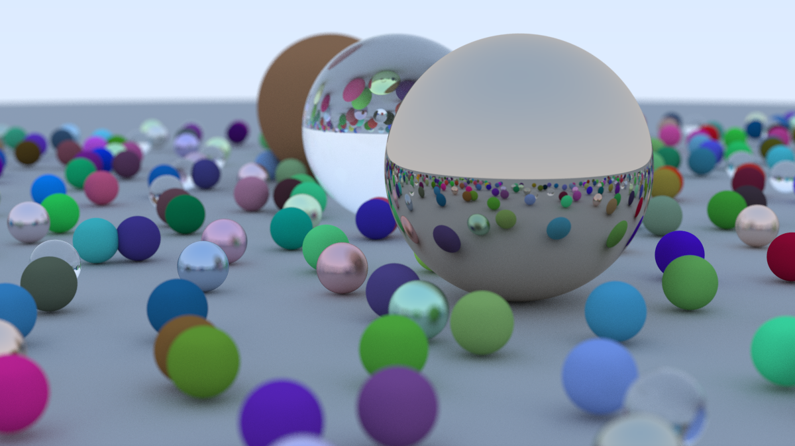

# Simple Multi-Threaded Rust Ray Tracing Demo

More information: <https://tung.github.io/posts/multi-threaded-rust-ray-tracing-demo/>

To try it out, run `cargo r --release`;
a window should open that continuously renders the scene above.

Rendering uses four threads by default;
you can use a different number by providing it as an argument, e.g. `cargo r --release -- 12` for twelve threads.

This is made with Miniquad, so it should work on Windows, macOS and Linux.
